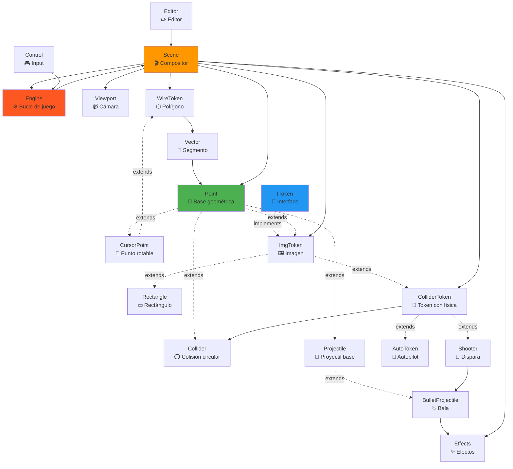

# 🏗️ Arquitectura del Motor Tactics

## 📊 Análisis de Clases y Dependencias

### **Jerarquía de Componentes**

```
📦 TACTICS ENGINE
│
├── 🎯 CORE (Núcleo del Motor)
│   ├── Scene          - Gestor principal de la escena
│   ├── Engine         - Bucle de juego y física
│   └── Viewport       - Sistema de cámara/vista
│
├── 🎮 CONTROL (Entrada de Usuario)
│   ├── Control        - Mapeo de teclas y eventos
│   └── Editor         - Editor de niveles en tiempo real
│
├── 📐 GEOMETRÍA (Sistema de Coordenadas)
│   ├── Point          - Punto básico 2D  [BASE]
│   ├── CursorPoint    - Punto con rotación [extends Point]
│   └── Vector         - Segmento entre dos puntos
│
├── 🎨 TOKENS (Entidades del Juego)
│   │
│   ├── IToken (interface) - Contrato común para todos los tokens
│   │
│   ├── ImgToken       - Token con imagen
│   ├── Rectangle      - Rectángulo básico [extends ImgToken]
│   ├── WireToken      - Polígono de vectores [extends CursorPoint]
│   │
│   ├── ColliderToken  - Token con física [extends ImgToken]
│   │   ├── Shooter       - Puede disparar [extends ColliderToken]
│   │   └── AutoToken     - Movimiento automático [extends ColliderToken]
│   │
│   └── Collider       - Sistema de colisión circular [extends Point]
│
└── 💥 PROYECTILES (Sistema de Disparos)
    ├── Projectile         - Proyectil base
    ├── BulletProjectile   - Bala con física [extends Projectile]
    └── Effects            - Efectos de impacto
```

---

## 🔗 Diagrama de Dependencias



---

## 📦 Estructura Detallada por Módulos

### **1. 🎯 CORE - Motor Principal**

#### **Scene** (Escena)
**Responsabilidad:** Compositor principal, gestor de canvas y ciclo de renderizado

```typescript
class Scene {
    canvas: HTMLCanvasElement
    arrTokens: Token[]          // Todos los objetos de la escena
    buffer: {
        drawing: Point[]         // Puntos en edición
        intersections: Point[]   // Puntos de colisión
        misc: any[]             // Buffer misceláneo
    }

    // Métodos principales
    drawScene(timestamp)         // Bucle de renderizado
    render()                     // Renderiza todos los tokens
    move(x, y)                   // Mueve la cámara
    centerOn(token)              // Centra en un token
    setToken(tokenId)            // Selecciona token activo
}
```

**Dependencias:**
- Usa: `ImgToken`, `ColliderToken`, `WireToken`, `Point`, `Effects`
- Usado por: `Engine`, `Control`, `Editor`

---

#### **Engine** (Motor)
**Responsabilidad:** Bucle de juego, actualización de física y lógica automática

```typescript
class Engine {
    scene: Scene
    mapkey: string[]            // Teclas presionadas

    start()                     // Inicia el bucle (16ms)
    automat()                   // Actualiza tokens automáticos
    resolver()                  // Procesa comandos de usuario
}
```

**Lógica:**
- Ejecuta `automat()` cada 16ms (~60 FPS)
- Actualiza `AutoToken`: autopilot
- Actualiza `Projectile`: movimiento de balas
- Verifica intersecciones en `WireToken`
- Limpia tokens marcados como `delete`

---

#### **Viewport** (Cámara)
**Responsabilidad:** Sistema de viewport con clipping opcional

```typescript
class Viewport {
    enabled: boolean
    x, y: number               // Posición del viewport
    width, height: number      // Dimensiones
}
```

---

### **2. 📐 GEOMETRÍA - Sistema de Coordenadas**

#### **Point** (Punto Base)
```typescript
class Point {
    x, y: number
    id: string
    config: { position: 'relative' | 'absolute', color, viewName }

    placeAt(x, y)
    getCenter()                // Retorna {x, y}
    draw(lColor, fColor, scene)
}
```

**Es la base de TODO:**
- Hereda: `CursorPoint`, `ImgToken`, `Collider`, `Projectile`

---

#### **CursorPoint** (Punto Rotable)
```typescript
class CursorPoint extends Point {
    rad: number                // Rotación en radianes
    displ: number              // Desplazamiento

    move(cmd, displ)           // 'up', 'down', 'left', 'right', 'tleft', 'tright'
}
```

**Usado por:** `WireToken`, y como base de movimiento para tokens físicos

---

#### **Vector** (Segmento de Línea)
```typescript
class Vector {
    a: Point                   // Punto inicial
    b: Point                   // Punto final

    draw(ctx)
    inRange(p)                 // Verifica si punto está en rango
    intersection(otherVector)  // Calcula intersección
}
```

**Función crítica:** Detección de intersecciones matemáticas para colisiones geométricas

---

### **3. 🎨 TOKENS - Entidades del Juego**

#### **IToken** (Interface)
```typescript
interface IToken {
    center: Point
    w, h: number               // Dimensiones
    rad: number                // Rotación
    displ: number              // Velocidad
    path: Point[]              // Trayectoria
    config: any
    delete: boolean            // Marca para eliminar
    id: string

    getCenter()
    move(cmd, displ)
}
```

---

#### **ImgToken** (Token con Imagen)
```typescript
class ImgToken extends Point implements IToken {
    src: string                // Path de imagen
    img: HTMLImageElement
    w, h: number
    rad: number

    draw(ctx)
    rotate(rad)
}
```

**Características:**
- Carga y renderiza imágenes
- Soporte de rotación
- Base para la mayoría de tokens visuales

---

#### **Rectangle** (Rectángulo)
```typescript
class Rectangle extends ImgToken {
    wire: WireToken            // Representación vectorial

    isCollisioning(other)      // Detección de colisión
    draw(ctx)
}
```

---

#### **WireToken** (Polígono Vectorial)
```typescript
class WireToken extends CursorPoint {
    points: Point[]            // Vértices del polígono
    config: { closed: boolean, color, radial }

    load(point)                // Añade vértice
    getVectors()               // Convierte puntos a vectores
    getIntersections(otherWire) // Detecta intersecciones
    setCenter()                // Calcula centroide
    move(cmd, displ)           // Mueve y rota el polígono
}
```

**Uso:** Muros, áreas personalizadas, dibujo libre en editor

---

#### **Collider** (Colisionador Circular)
```typescript
class Collider extends Point {
    radius: number
    subColliders: Collider[]   // Sistema recursivo

    isCollisioning(other)      // Detección jerárquica
    getCollisions(tokens)      // Busca colisiones en array
    move(cmd, displ, tokens)   // Mueve con detección
    addSubCollider()           // Añade sub-colisionador
}
```

**Sistema de colisión jerárquica:**
- Verifica distancia entre centros
- Si colisionan, verifica sub-colliders recursivamente
- Usa `back[]` para revertir movimientos inválidos

---

#### **ColliderToken** (Token Físico)
```typescript
class ColliderToken extends ImgToken {
    collider: Collider
    health: number

    move(cmd, displ, tokens)   // Movimiento con física
    getCenter()
    draw(ctx)
}
```

**Combina:** Imagen + Física de colisión

---

#### **Shooter** (Token que Dispara)
```typescript
class Shooter extends ColliderToken {
    reloading: boolean
    bulletCount: number

    shot()                     // Crea BulletProjectile
}
```

---

#### **AutoToken** (Token Automático)
```typescript
class AutoToken extends ColliderToken {
    plan: string[]             // ['up', 'up', 'left', ...]

    autopilot(tokens)          // Ejecuta el plan
}
```

---

### **4. 💥 PROYECTILES - Sistema de Disparos**

#### **Projectile** (Proyectil Base)
```typescript
class Projectile extends Point {
    rad: number
    displ: number              // Velocidad
    range: number              // Alcance restante
    effect: Function           // Efecto al impactar

    move()
    shot()
}
```

---

#### **BulletProjectile** (Bala)
```typescript
class BulletProjectile extends Projectile {
    collider: Collider
    from: string               // ID del disparador

    shot(tokens)               // Mueve y detecta colisiones
}
```

**Lógica:**
- Se mueve cada frame
- Verifica colisiones
- Aplica efecto al impactar
- Se auto-elimina (`delete = true`)

---

#### **Effects** (Efectos de Impacto)
```typescript
const Effects = {
    damage(collisions, bullet) // Reduce salud
    split(collisions, bullet)  // Fragmenta bala
    brick(collisions, bullet)  // Destruye ladrillos
}
```

---

### **5. 🎮 CONTROL - Entrada de Usuario**

#### **Control** (Gestor de Input)
```typescript
class Control {
    moveCMD: ['left', 'right', 'up', 'down']
    fireCMD: ['fire']

    keyCommand(keyCode)        // Mapea tecla a comando
    // Listeners: onkeydown, onkeyup
}
```

**Mapeo de teclas:**
- Flechas: Movimiento
- Espacio: Disparar

---

#### **Editor** (Editor de Niveles)
```typescript
class Editor {
    points: Point[]            // Puntos en edición

    // Eventos:
    onclick(canvas)            // Añade punto
    onkeypress:
      - 'n': Crea WireToken con puntos actuales
      - 'd': Borra puntos
      - 's': Demo de rotación
}
```

---

## 🔑 Conceptos Clave del Motor

### **1. Sistema de Coordenadas**
- **Relativas:** Respecto a la escena (mayoría de tokens)
- **Absolutas:** Respecto al canvas (UI, overlays)

### **2. Bucle de Renderizado**
```javascript
drawScene(timestamp) {
    1. Limpiar canvas
    2. Actualizar posición de cámara
    3. Renderizar grid si está activo
    4. Dibujar cada token en arrTokens[]
    5. Dibujar buffers (drawing, intersections)
    6. Mostrar info de debug
    7. requestAnimationFrame(drawScene)
}
```

### **3. Detección de Colisiones**

**Circular (Collider):**
```
distance = √((x₁-x₂)² + (y₁-y₂)²)
collision = distance < (r₁ + r₂)
```

**Geométrica (Vector.intersection):**
- Resuelve ecuaciones de rectas
- Verifica si punto está en rango de ambos vectores
- Maneja casos especiales (verticales, horizontales, paralelas)

### **4. Movimiento con Física**
```javascript
Collider.move(cmd, displ, tokens) {
    1. Guarda posición actual en back[]
    2. Mueve el collider
    3. Verifica colisiones con tokens[]
    4. Si hay colisión:
       - Revierte a posición anterior
       - Retorna canMove: false
    5. Si no:
       - Retorna canMove: true
}
```

---

## 📋 Propuesta de Estructura como Librería

### **Arquitectura Modular**

```
tactics-engine/
├── src/
│   ├── core/              # Motor principal
│   │   ├── Scene.ts
│   │   ├── Engine.ts
│   │   └── Viewport.ts
│   │
│   ├── geometry/          # Primitivas geométricas
│   │   ├── Point.ts
│   │   ├── CursorPoint.ts
│   │   └── Vector.ts
│   │
│   ├── tokens/            # Entidades del juego
│   │   ├── IToken.ts
│   │   ├── ImgToken.ts
│   │   ├── Rectangle.ts
│   │   ├── WireToken.ts
│   │   ├── Collider.ts
│   │   ├── ColliderToken.ts
│   │   ├── Shooter.ts
│   │   └── AutoToken.ts
│   │
│   ├── projectiles/       # Sistema de proyectiles
│   │   ├── Projectile.ts
│   │   ├── BulletProjectile.ts
│   │   └── Effects.ts
│   │
│   ├── input/             # Control de usuario
│   │   ├── Control.ts
│   │   └── Editor.ts
│   │
│   ├── utils/             # Utilidades
│   │   └── Math.ts
│   │
│   └── index.ts           # Export público de la librería
│
├── examples/              # Ejemplos de uso
│   ├── basic/
│   ├── collision/
│   └── editor/
│
├── docs/
│   ├── API.md
│   ├── GETTING_STARTED.md
│   └── EXAMPLES.md
│
└── package.json
```

---

### **API Pública Propuesta**

```typescript
// index.ts - Exports públicos
export { Scene, Engine, Viewport } from './core';
export { Point, CursorPoint, Vector } from './geometry';
export {
    IToken,
    ImgToken,
    Rectangle,
    WireToken,
    ColliderToken,
    Collider,
    Shooter,
    AutoToken
} from './tokens';
export { Projectile, BulletProjectile, Effects } from './projectiles';
export { Control, Editor } from './input';

// Uso simplificado:
import { Scene, Engine, Control, Shooter, ColliderToken } from 'tactics-engine';

const scene = new Scene('myCanvas');
const player = new Shooter('player', 0, 0, 0, 'player.png', 100, 50);
scene.arrTokens.push(player);

const engine = new Engine(scene);
const control = new Control(engine);
engine.start();
```

---

### **Mejoras Sugeridas para Librería**

#### **1. TypeScript Completo**
- Convertir todas las funciones a clases
- Eliminar `prototype`
- Usar tipos estrictos

#### **2. Sistema de Eventos**
```typescript
scene.on('collision', (token, other) => {});
scene.on('token:destroyed', (token) => {});
```

#### **3. Configuración Centralizada**
```typescript
const config = {
    canvas: 'myCanvas',
    fps: 60,
    debug: true,
    viewport: { enabled: true, width: 800, height: 600 }
};
const scene = new Scene(config);
```

#### **4. Gestión de Assets**
```typescript
const assetManager = new AssetManager();
await assetManager.preload(['player.png', 'enemy.png']);
```

#### **5. Sistema de Plugins**
```typescript
scene.use(PhysicsPlugin);
scene.use(DebugUIPlugin);
```

---

## 🎯 Próximos Pasos

### **Fase 1: Refactorización**
1. ✅ Convertir funciones a clases ES6
2. ✅ Eliminar dependencias circulares
3. ✅ Tipado completo con TypeScript
4. ✅ Tests unitarios

### **Fase 2: Modularización**
1. ✅ Separar en paquetes npm
2. ✅ Tree-shaking friendly
3. ✅ Build con Rollup/Vite
4. ✅ Documentación con TypeDoc

### **Fase 3: Distribución**
1. ✅ Publicar en npm
2. ✅ Crear playground online
3. ✅ Ejemplos interactivos
4. ✅ Website con documentación

---

## 📚 Conclusión

**Tactics Engine** es un motor 2D sólido con:
- ✅ Sistema de física robusto (colisiones circulares y vectoriales)
- ✅ Editor integrado en tiempo real
- ✅ Arquitectura extensible (herencia clara)
- ✅ Soporte de geometría avanzada (intersecciones, rotaciones)

**Para convertirlo en librería:**
- Refactorizar a TypeScript moderno
- Crear API pública clara
- Documentar exhaustivamente
- Añadir ejemplos ejecutables
- Publicar en npm

---

**¿Listo para empezar la conversión? Podemos comenzar por el módulo que prefieras.**
